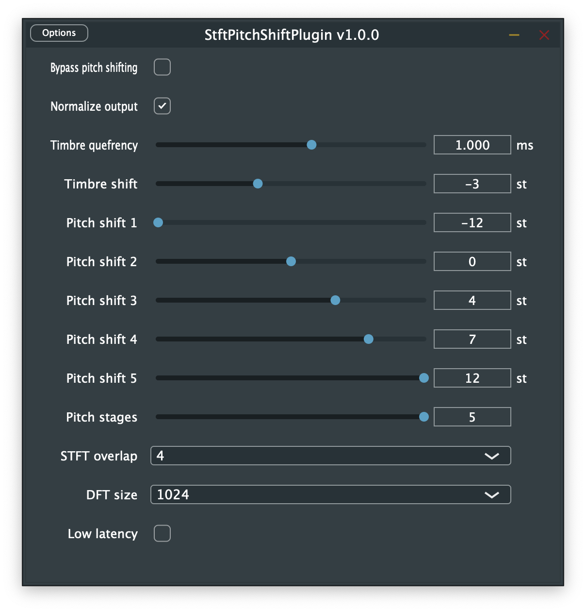

# Official JUCE plugin for stftPitchShift

The _stftPitchShiftPlugin_ features poly pitch and timbre shifting simultaneously and in real-time.
It's completely based on the [stftPitchShift](https://github.com/jurihock/stftPitchShift) library,
which also provides a Python interface and useful command line tools.

## Features

Following features are currently included:

- poly pitch shifting with or without formant preservation,
- pitch independent timbre changing,
- low latency capability depending on the preset block size,
- optional output normalization to match the input loudness level.

The _stftPitchShiftPlugin_ is available in VST3, AU, LV2 formats as well as a standalone app.
It also provides a basic UI to adjust the effect parameters on the fly:

Please refer to the [User Manual](MANUAL.md) for detailed explanations.

## Binaries

The ready to use binaries can be obtained in two ways:

- via continuous build artifacts or
- via a local build from the source code.

### Continuous build artifacts

Use one of the following links to download the latest binaries for your specific operating system:

- [macOS](https://nightly.link/jurihock/stftPitchShiftPlugin/workflows/build/main/StftPitchShiftPlugin-macos-latest.zip)
- [Ubuntu](https://nightly.link/jurihock/stftPitchShiftPlugin/workflows/build/main/StftPitchShiftPlugin-ubuntu-latest.zip)
- [Windows](https://nightly.link/jurihock/stftPitchShiftPlugin/workflows/build/main/StftPitchShiftPlugin-windows-latest.zip)

On macOS, you will also have to deal with the [Gatekeeper](https://support.apple.com/HT202491),
in order to execute the standalone app or to load the AU or VST3 plugin in your DAW.

### Build from source code

Since the project is based on _CMake_, it can be compiled in the same way on any of the supported operating systems.

Please read the official JUCE [documentation](https://github.com/juce-framework/JUCE/blob/master/docs/CMake%20API.md) and the included script files:

- [build_macos.sh](scripts/build_macos.sh)
- [build_ubuntu.sh](scripts/build_ubuntu.sh)
- [build_windows.bat](scripts/build_windows.bat)

The advantage of this method on macOS is that no additional _Gatekeeper_ handling is required.

## Last but not least

This project is currently at an early development stage, so expect more highlights to come.

Stay tuned!

## Credits

- [JUCE](https://github.com/juce-framework/JUCE) by JUCE Team
- [PocketFFT](https://gitlab.mpcdf.mpg.de/mtr/pocketfft) by Martin Reinecke
- [pluginval](https://github.com/Tracktion/pluginval) by Tracktion Team
- [nightly.link](https://github.com/oprypin/nightly.link) by Oleh Prypin

## License

*stftPitchShiftPlugin* is licensed under the terms of the GPL license.
For details please refer to the accompanying [LICENSE](LICENSE) file distributed with *stftPitchShiftPlugin*.
